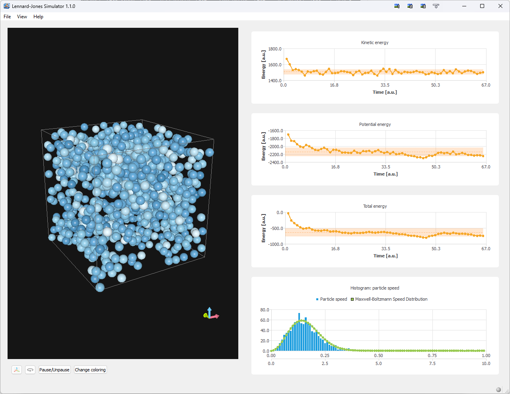

# Lennard-Jones Simulator

## Overview
The **Lennard-Jones Simulator** is a simple visual molecular dynamics simulation
tool that models the interactions of particles using the **Lennard-Jones
potential**. It provides a real-time 3D visualization of particle motion along
with analytical plots of system properties, such as energy and speed
distribution.

## Features
- **3D Particle Simulation**: Visualizes the interaction of particles in a
  confined cubic box. Particles are color-coded based on their velocity.
- **Energy Monitoring**: Tracks kinetic energy, potential energy, and total
  energy over time.
- **Maxwell-Boltzmann Speed Distribution**: Compares simulated particle speed
  distribution with theoretical predictions.